# 按照固定方式转换图像
## Pad
fills image borders with some pixel values.

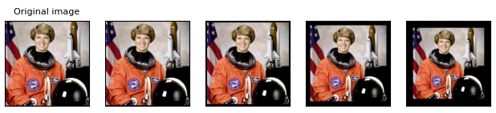

## Resize
将图像Resize成指定尺寸，还可以选择h和w，以及插值方式

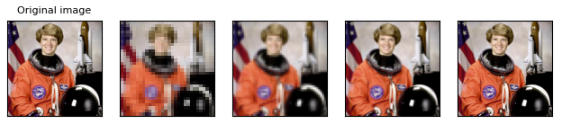

## CenterCrop
crops the given image at the center.可以指定h和w

## FiveCrop
crops the given image into four corners and the central crop.返回5张图（四个角+中央）

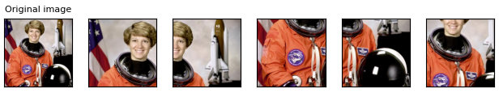

## Grayscale
converts an image to grayscale

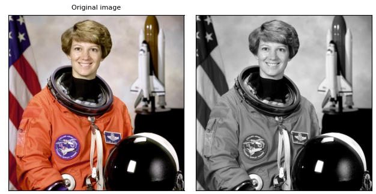

# 按照随机方式转换图像
## ColorJitter
randomly changes the brightness, saturation, and other properties of an image. 亮度、对比度、饱和度、色调

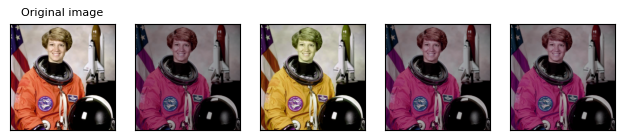

## GaussianBlur
randomly performs gaussian blur transform on an image. 高斯模糊

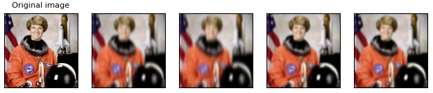

## RandomPerspective
randomly performs random perspective transform on an image.透视变换。可以指定变换尺度、执行概率

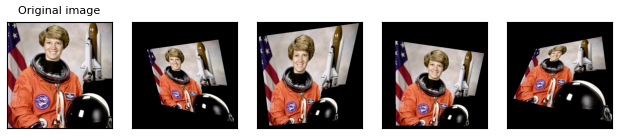

## RandomRotation
randomly rotates an image with random angle.旋转

## RandomAffine
randomly performs random affine transform on an image.仿射变换

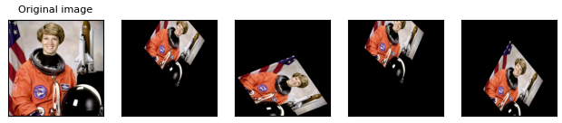

## RandomCrop
randomly crops an image at a random location.随机裁剪

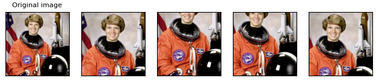

## RandomResizedCrop
randomly crops an image at a random location, and then resizes the crop to a given size.
随机截取一个区域，然后resize到指定尺寸

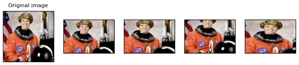

## RandomInvert
randomly inverts the colors of the given image.图像反相

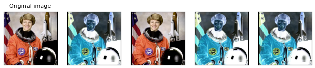

## RandomPosterize
randomly posterizes the image by reducing the number of bits of each color channel.
减少颜色通道的bit位数，每个颜色通道上，取值为【0~255】为8个bit；当bit位数减少时，就相当于对色彩做了离散

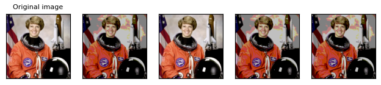

## RandomSolarize
randomly solarizes the image by inverting all pixel values above the threshold.
图像日光化，大于等于设定阈值的像素会被取反相，阈值设置为0时等价于RandomInvert

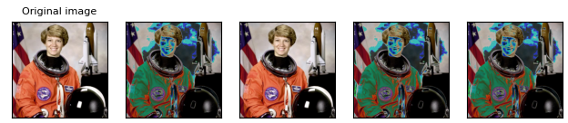

## RandomAdjustSharpness
randomly adjusts the sharpness of the given image.
锐化

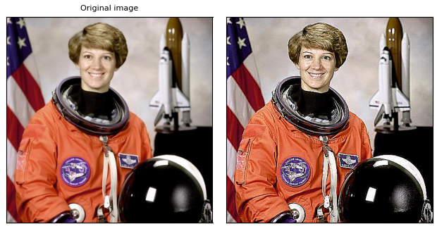

## RandomAutocontrast
randomly applies autocontrast to the given image.
自动对比度

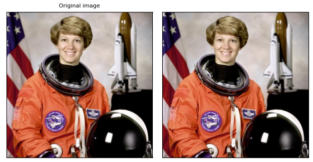

## RandomEqualize
randomly equalizes the histogram of the given image.
直方图均衡化

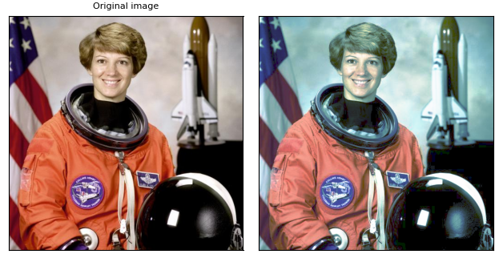

## AutoAugment
transform automatically augments data based on a given auto-augmentation policy.
采用已有数据的数据增广方案

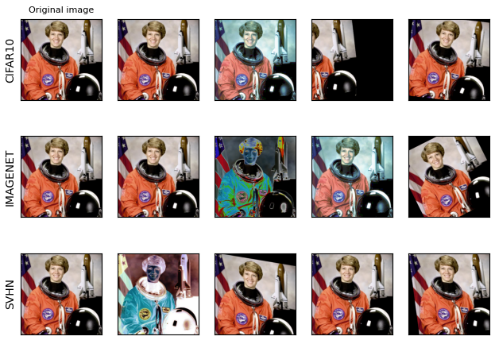

## RandAugment
transform automatically augments the data.
随机增广，可以控制变化的幅度和种类数

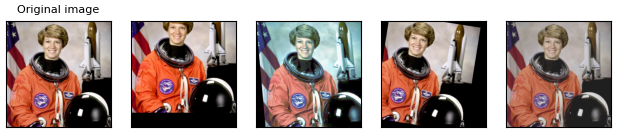

## TrivialAugmentWide
https://arxiv.org/pdf/2103.10158.pdf 经验总结的一套增广方案

## AugMix
https://arxiv.org/pdf/1912.02781.pdf 常用的图像融合，提升模型鲁棒性的增广方案

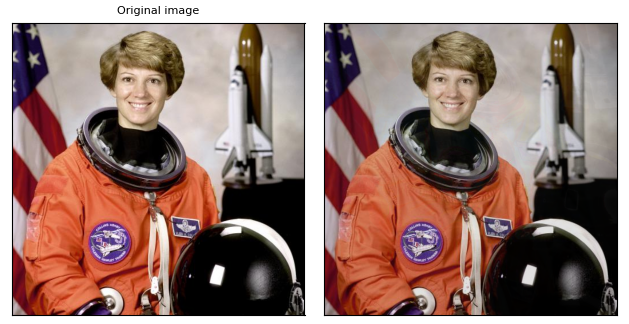

## RandomHorizontalFlip
performs horizontal flip of an image, with a given probability. 水平翻转

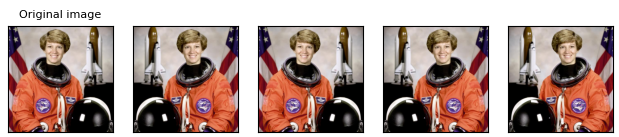

## RandomVerticalFlip
performs vertical flip of an image, with a given probability. 竖直翻转

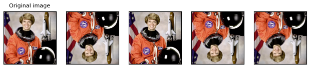

## RandomApply
randomly applies a list of transforms, with a given probability.
按照一定概率，执行一系列的转换

# 参考
https://pytorch.org/vision/stable/auto_examples/plot_transforms.html

