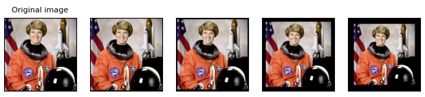
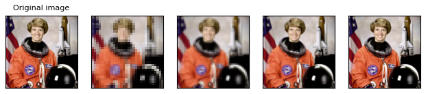
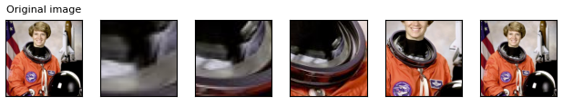
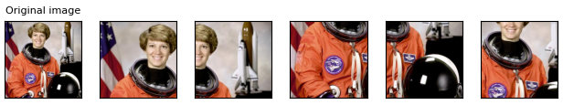
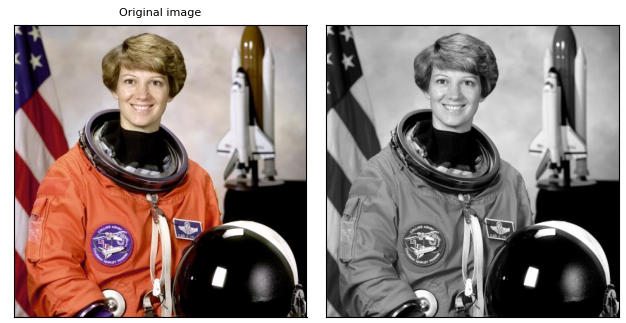
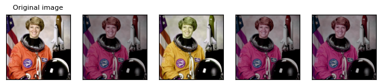
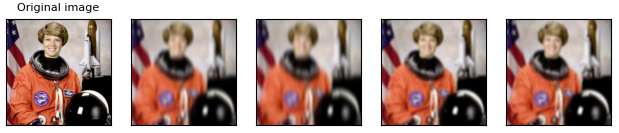
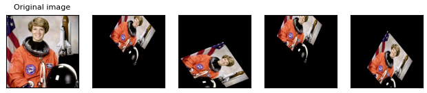
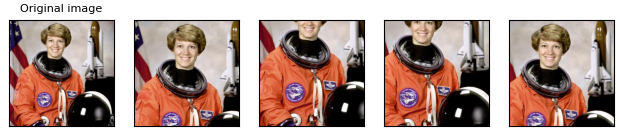

# 按照固定方式转换图像
## Pad
fills image borders with some pixel values.

## Resize
将图像Resize成指定尺寸，还可以选择h和w，以及插值方式

## CenterCrop
crops the given image at the center.可以指定h和w

## FiveCrop
crops the given image into four corners and the central crop.返回5张图（四个角+中央）

## Grayscale
converts an image to grayscale

# 按照随机方式转换图像
## ColorJitter
randomly changes the brightness, saturation, and other properties of an image. 亮度、对比度、饱和度、色调

## GaussianBlur
performs gaussian blur transform on an image. 高斯模糊

## RandomPerspective
performs random perspective transform on an image.透视变换。可以指定变换尺度、执行概率

## RandomRotation
rotates an image with random angle.旋转

## RandomAffine
performs random affine transform on an image.仿射变换

## RandomCrop
crops an image at a random location.随机裁剪

# 参考
https://pytorch.org/vision/stable/auto_examples/plot_transforms.html

