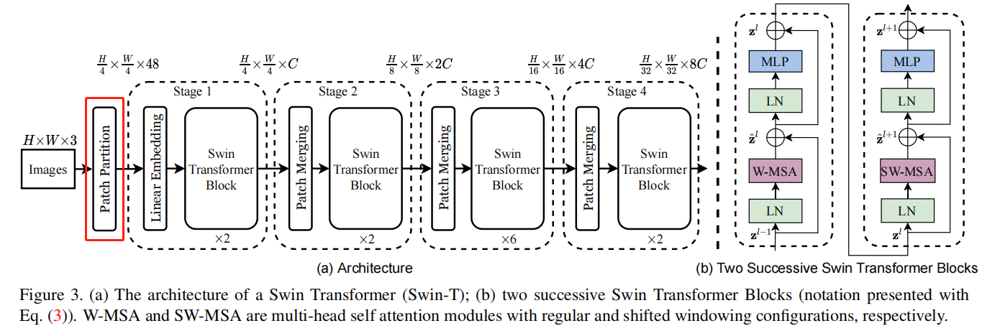
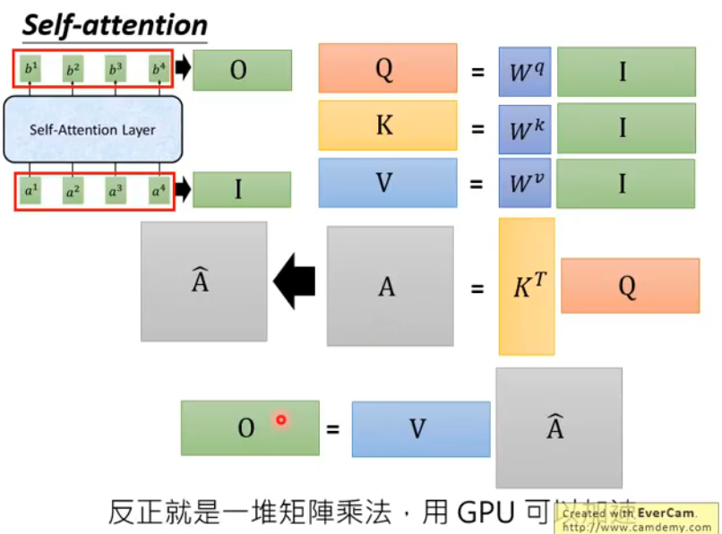
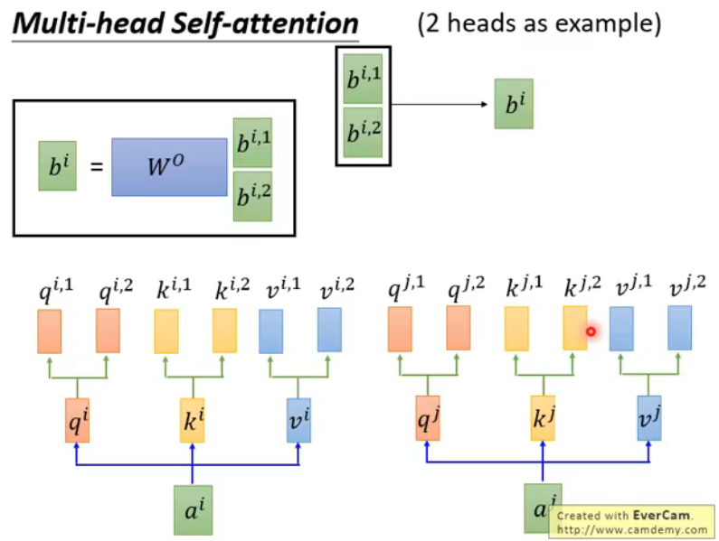
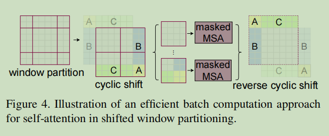
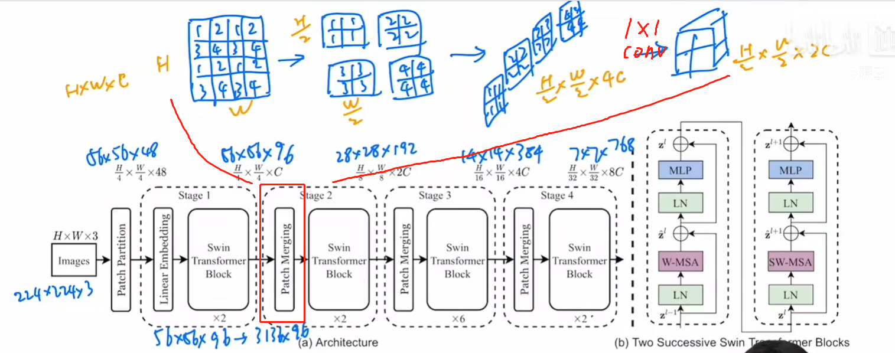
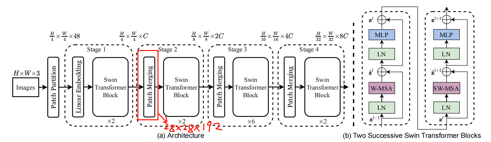
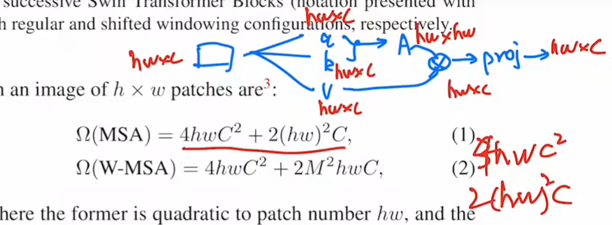

本文以pytorch提供的官方 Swin_T 为例进行梳理。

# 模型总览

input的H=224，W=224，经过4个stage，得到7 * 7 * C的输出。

如果做分类的话，可以做一个拉直，然后连接分类头即可。
pytorch中做分类任务时，前向传播代码为：
```python
def forward(self, x):
    x = self.features(x)
    x = self.norm(x)
    x = x.permute(0, 3, 1, 2)
    x = self.avgpool(x)
    x = torch.flatten(x, 1)
    x = self.head(x)
    return x
```

# Patch Partition
下面来看Patch Partition的部分

主要工作就是 split image into non-overlapping patches
代码为：
```python
layers.append(
    nn.Sequential(
        nn.Conv2d(
            3, embed_dim, kernel_size=(patch_size[0], patch_size[1]), stride=(patch_size[0], patch_size[1])
        ),
        Permute([0, 2, 3, 1]),
        norm_layer(embed_dim),
    )
)
```
其中，patch_size=[4, 4]

也就是把图片切成56*56个4 * 4 的小patch。

因此，输出为56 *56 * 48。

48 是由 4(patch的H) * 4(patch的W) * 3(patch的深度)算出来的。


# Linear Embedding

其中，embed_dim=96。
Linear Embedding的作用就是将每个4 *4的patch转换成一个长度=96的嵌入向量。

对应代码就是上面的，步长=4，卷积核尺寸为4的卷积。

然后，进行Linear Embedding，其中embed_dim=96=C，
也就是将每个patch转成一个长度为C的向量，此时的输出为(B=32,C=96,H=56,W=56)

接着，使用Permute将输出转换为(B,H,W,C)，然后做nn.LayerNorm。
至于为什么要使用Permute，可以参考[nn.LayerNorm的实现及原理](https://blog.csdn.net/weixin_41978699/article/details/122778085)

# Swin Transformer Block

这是最核心的模块，可以看出四个stage的重复个数依次为2 2 6 2，都是偶数
这是有原因的，原因就是，这两个块必须接连依次出现。


# 各个stage的维度变化分析
我们来看一下和维度有关的代码
```python
class SwinTransformer(nn.Module):
    def __init__(...):
        ...
        # build SwinTransformer blocks
        for i_stage in range(len(depths)):
            dim = embed_dim * 2 ** i_stage
            for i_layer in range(depths[i_stage]):
                ...
```
其中，depths=[2, 2, 6, 2]；embed_dim=96=C

由dim = embed_dim * 2 ** i_stage可知，经过每个stage之后的维度变成C、2C、4C、8C
对应下图：


# 创建 Swin Transformer Block时的入参
前面已经说了，Block有两种，并且是有前后顺序并同时出现的。

他们的不同之处，就在于红框中的东西，那么我们就要研究一下入参有什么区别。
对应代码为：
```python
for i_layer in range(depths[i_stage]):
    ...
    stage.append(
        block(
            dim,
            num_heads[i_stage],
            window_size=window_size,
            shift_size=[0 if i_layer % 2 == 0 else w // 2 for w in window_size],
            mlp_ratio=mlp_ratio,
            dropout=dropout,
            attention_dropout=attention_dropout,
            stochastic_depth_prob=sd_prob,
            norm_layer=norm_layer,
        )
    )
```
其中，window_size=[7, 7]

可以看出，不同之处仅在于shift_size。当i_layer=偶数时，shift_size=[0,0]，否则等于[w // 2,w // 2]

下面我们进入block的内部，看看他的定义

# SwinTransformerBlock
```python
class SwinTransformerBlock(nn.Module):
    def __init__(...):
        self.norm1 = norm_layer(dim)
        self.attn = attn_layer(
            dim,
            window_size,
            shift_size,
            num_heads,
            attention_dropout=attention_dropout,
            dropout=dropout,
        )
        self.stochastic_depth = StochasticDepth(stochastic_depth_prob, "row")
        self.norm2 = norm_layer(dim)
        self.mlp = MLP(dim, [int(dim * mlp_ratio), dim], activation_layer=nn.GELU, inplace=None, dropout=dropout)
        ...
        
    def forward(self, x: Tensor):
        x = x + self.stochastic_depth(self.attn(self.norm1(x)))
        x = x + self.stochastic_depth(self.mlp(self.norm2(x)))
        return x
```

从上面的代码和图示可以看出，张量依次进行：
- LayerNorm
- W-MSA或者SW-MSA (W-MSA and SW-MSA are multi-head self attention modules with regular and shifted windowing configurations, respectively.)
- stochastic_depth连接
- LayerNorm
- mlp
- stochastic_depth连接

这里面核心的部分就是W-MSA和SW-MSA了，他们定义在ShiftedWindowAttention类中，我们来看看他们做了什么事情。

# W-MSA和SW-MSA
```python
class ShiftedWindowAttention(nn.Module):
    def __init__(...):
        ...
        self.qkv = nn.Linear(dim, dim * 3, bias=qkv_bias)
        self.proj = nn.Linear(dim, dim, bias=proj_bias)

        # define a parameter table of relative position bias
        self.relative_position_bias_table = nn.Parameter(
            torch.zeros((2 * window_size[0] - 1) * (2 * window_size[1] - 1), num_heads)
        )  # 2*Wh-1 * 2*Ww-1, nH

        # get pair-wise relative position index for each token inside the window
        coords_h = torch.arange(self.window_size[0])
        coords_w = torch.arange(self.window_size[1])
        coords = torch.stack(torch.meshgrid(coords_h, coords_w, indexing="ij"))  # 2, Wh, Ww
        coords_flatten = torch.flatten(coords, 1)  # 2, Wh*Ww
        relative_coords = coords_flatten[:, :, None] - coords_flatten[:, None, :]  # 2, Wh*Ww, Wh*Ww
        relative_coords = relative_coords.permute(1, 2, 0).contiguous()  # Wh*Ww, Wh*Ww, 2
        relative_coords[:, :, 0] += self.window_size[0] - 1  # shift to start from 0
        relative_coords[:, :, 1] += self.window_size[1] - 1
        relative_coords[:, :, 0] *= 2 * self.window_size[1] - 1
        relative_position_index = relative_coords.sum(-1).view(-1)  # Wh*Ww*Wh*Ww
        self.register_buffer("relative_position_index", relative_position_index)

        nn.init.trunc_normal_(self.relative_position_bias_table, std=0.02)

    def forward(self, x: Tensor):
        N = self.window_size[0] * self.window_size[1]
        relative_position_bias = self.relative_position_bias_table[self.relative_position_index]  # type: ignore[index]
        relative_position_bias = relative_position_bias.view(N, N, -1)
        relative_position_bias = relative_position_bias.permute(2, 0, 1).contiguous().unsqueeze(0)

        return shifted_window_attention(
            ...,
            shift_size=self.shift_size,
            ...
        )
```
从以上代码可以看出，W-MSA和SW-MSA在定义上几乎一致的，区别仅在于forward()中的shifted_window_attention().

那么，我们就先分析一下他们共性的东西都在做什么事情。

首先是初始化了qkv矩阵、投影矩阵以及相对位置偏差
```python
self.qkv = nn.Linear(dim, dim * 3, bias=qkv_bias)
self.proj = nn.Linear(dim, dim, bias=proj_bias)

# define a parameter table of relative position bias
self.relative_position_bias_table = nn.Parameter(
    torch.zeros((2 * window_size[0] - 1) * (2 * window_size[1] - 1), num_heads)
)  # 2*Wh-1 * 2*Ww-1, nH
```

然后是建立window内的索引
```python
# get pair-wise relative position index for each token inside the window
coords_h = torch.arange(self.window_size[0])
coords_w = torch.arange(self.window_size[1])
coords = torch.stack(torch.meshgrid(coords_h, coords_w, indexing="ij"))  # 2, Wh, Ww
coords_flatten = torch.flatten(coords, 1)  # 2, Wh*Ww
relative_coords = coords_flatten[:, :, None] - coords_flatten[:, None, :]  # 2, Wh*Ww, Wh*Ww
relative_coords = relative_coords.permute(1, 2, 0).contiguous()  # Wh*Ww, Wh*Ww, 2
relative_coords[:, :, 0] += self.window_size[0] - 1  # shift to start from 0
relative_coords[:, :, 1] += self.window_size[1] - 1
relative_coords[:, :, 0] *= 2 * self.window_size[1] - 1
relative_position_index = relative_coords.sum(-1).view(-1)  # Wh*Ww*Wh*Ww
self.register_buffer("relative_position_index", relative_position_index)

nn.init.trunc_normal_(self.relative_position_bias_table, std=0.02)
```

下面我们看shifted_window_attention：
# shifted_window_attention
```python
def shifted_window_attention(...):
    B, H, W, C = input.shape
    # pad feature maps to multiples of window size
    pad_r = (window_size[1] - W % window_size[1]) % window_size[1]
    pad_b = (window_size[0] - H % window_size[0]) % window_size[0]
    x = F.pad(input, (0, 0, 0, pad_r, 0, pad_b))
    _, pad_H, pad_W, _ = x.shape
    ...
    
    # cyclic shift
    if sum(shift_size) > 0:
        x = torch.roll(x, shifts=(-shift_size[0], -shift_size[1]), dims=(1, 2))

    # partition windows
    num_windows = (pad_H // window_size[0]) * (pad_W // window_size[1])
    x = x.view(B, pad_H // window_size[0], window_size[0], pad_W // window_size[1], window_size[1], C)
    x = x.permute(0, 1, 3, 2, 4, 5).reshape(B * num_windows, window_size[0] * window_size[1], C)  # B*nW, Ws*Ws, C

    # multi-head attention
    qkv = F.linear(x, qkv_weight, qkv_bias)
    qkv = qkv.reshape(x.size(0), x.size(1), 3, num_heads, C // num_heads).permute(2, 0, 3, 1, 4)
    q, k, v = qkv[0], qkv[1], qkv[2]
    q = q * (C // num_heads) ** -0.5
    attn = q.matmul(k.transpose(-2, -1))
    # add relative position bias
    attn = attn + relative_position_bias

    if sum(shift_size) > 0:
        # generate attention mask
        attn_mask = x.new_zeros((pad_H, pad_W))
        h_slices = ((0, -window_size[0]), (-window_size[0], -shift_size[0]), (-shift_size[0], None))
        w_slices = ((0, -window_size[1]), (-window_size[1], -shift_size[1]), (-shift_size[1], None))
        count = 0
        for h in h_slices:
            for w in w_slices:
                attn_mask[h[0] : h[1], w[0] : w[1]] = count
                count += 1
        attn_mask = attn_mask.view(pad_H // window_size[0], window_size[0], pad_W // window_size[1], window_size[1])
        attn_mask = attn_mask.permute(0, 2, 1, 3).reshape(num_windows, window_size[0] * window_size[1])
        attn_mask = attn_mask.unsqueeze(1) - attn_mask.unsqueeze(2)
        attn_mask = attn_mask.masked_fill(attn_mask != 0, float(-100.0)).masked_fill(attn_mask == 0, float(0.0))
        attn = attn.view(x.size(0) // num_windows, num_windows, num_heads, x.size(1), x.size(1))
        attn = attn + attn_mask.unsqueeze(1).unsqueeze(0)
        attn = attn.view(-1, num_heads, x.size(1), x.size(1))

    attn = F.softmax(attn, dim=-1)
    attn = F.dropout(attn, p=attention_dropout)

    x = attn.matmul(v).transpose(1, 2).reshape(x.size(0), x.size(1), C)
    x = F.linear(x, proj_weight, proj_bias)
    x = F.dropout(x, p=dropout)

    # reverse windows
    x = x.view(B, pad_H // window_size[0], pad_W // window_size[1], window_size[0], window_size[1], C)
    x = x.permute(0, 1, 3, 2, 4, 5).reshape(B, pad_H, pad_W, C)

    # reverse cyclic shift
    if sum(shift_size) > 0:
        x = torch.roll(x, shifts=(shift_size[0], shift_size[1]), dims=(1, 2))

    # unpad features
    x = x[:, :H, :W, :].contiguous()
    return x
```
B, H, W, C = input.shape #数据依次为 32 56 56 96

在第一个block中x.shape和input.shape相同

在W-MSA中，shift_size=[0,0]

# partition windows
```python
# partition windows
num_windows = (pad_H // window_size[0]) * (pad_W // window_size[1])
```
其中，pad_H = pad_W = 56；window_size = [7, 7]

因此，特征图会被划分为64块，即 num_windows = 8 * 8 = 64

接下来，对x（维度为(32,56,56,96)）执行以下代码：
```python
x = x.view(B, pad_H // window_size[0], window_size[0], pad_W // window_size[1], window_size[1], C)
x = x.permute(0, 1, 3, 2, 4, 5).reshape(B * num_windows, window_size[0] * window_size[1], C)  # B*nW, Ws*Ws, C
```
- 第1行会将x的维度转为(32,8,7,8,7,96)。
- 第2行的permute会将x的维度转为(32,8,8,7,7,96)，然后再转为(2048,49,96) # B * nW, Ws * Ws, C。
这里的2048可以理解为BERT里的batch size，49可以理解为序列长度，现在只不过把
一个7 * 7的窗口拉成了49，96可以理解为每个token的嵌入。

这么做的目的是并行计算。

处理完x后，就要进行multi-head attention了。

# multi-head attention
```python
qkv = F.linear(x, qkv_weight, qkv_bias)
qkv = qkv.reshape(x.size(0), x.size(1), 3, num_heads, C // num_heads).permute(2, 0, 3, 1, 4)
q, k, v = qkv[0], qkv[1], qkv[2]
q = q * (C // num_heads) ** -0.5
attn = q.matmul(k.transpose(-2, -1))
```
整个过程可以参考[李宏毅的讲义](https://www.bilibili.com/video/av48285039?p=92&vd_source=a0ed88162ba357c3f44aa427ad89574b)

第1行：qkv = F.linear(x, qkv_weight, qkv_bias) 表示y = xA^T + b，qkv的维度是(2048,49,288)

第2行：qkv.reshape(x.size(0), x.size(1), 3, num_heads, C // num_heads) 得到维度(2048,49,3,3,32)
第一个3是因为q,k,v是三个实体，num_heads=3表示当前使用了多少个注意力头，C // num_heads则自动计算出每个头的维度

第3行：q, k, v = qkv[0], qkv[1], qkv[2]
其中，q, k, v的维度均为(2048,3,49,32)

第4行是一种对query做缩放的方式

第5行是query和key求内积。得到的attn的维度是(2048,3,49,49)，这里得到49 *49
是非常直观的，因为序列长度为49，attention就是要两两之间进行计算

接下来，对求得的值加上相对位置编码
# add relative position bias
```python
attn = attn + relative_position_bias
```
relative_position_bias的维度是(1,3,49,49)

# attn归一化和输出结果
```python
attn = F.softmax(attn, dim=-1)
attn = F.dropout(attn, p=attention_dropout)

x = attn.matmul(v).transpose(1, 2).reshape(x.size(0), x.size(1), C)
x = F.linear(x, proj_weight, proj_bias)
x = F.dropout(x, p=dropout)
```
到此，x的维度为(2048,49,96)


关于投射层，就是多头自注意力之后降维到我们想要的维度



下一步要恢复回窗口
# reverse windows
```python
x = x.view(B, pad_H // window_size[0], pad_W // window_size[1], window_size[0], window_size[1], C)
x = x.permute(0, 1, 3, 2, 4, 5).reshape(B, pad_H, pad_W, C)
```
得到的输出维度为(32,56,56,96)

再下一步，进行类似残差连接的操作。
# stochastic_depth
 A LayerNorm (LN) layer is applied
before each MSA module and each MLP, and a residual
connection is applied after each module.

# W-MSA小结
以上，我们就完成了W-MSA的过程。W-MSA主要就是在Linear Embedding后的
(B=32,C=96,H=56,W=56)的输入上，在进行7 *7的步长为7的partition windows操作。
可以理解为得到了64个句子，64 * batchsize32 = 2048，这个是可以并行运算的。
每个句子有49个token，每个token有C=96的维度。

也就是说，W-MSA在做局部的attention（7 * 7的窗口内做attention）

之所以在局部做attention主要是为了节省计算量，后面我们会量化分析能够节省多少计算

但是在节省计算的同时，也带来了2个问题，第一个就是只能attention到局部的信息，不能attention到更全局的信息，
第二个是在窗口之间相互独立，而图像的信息是连续的，这样建模势必会降低模型效果（用作者的话就是compute self-attention within local windows.）。

为了解决第二个问题，作者提出了SW-MSA算法（用作者的话The
window-based self-attention module lacks connections
across windows, which limits its modeling power.），前面我们说了SW-MSA和W-MSA类似。
下面，我们来看看SW-MSA和W-MSA比有哪些区别

# SW-MSA和W-MSA的区别
先看一下他们在代码上的区别
```python
def shifted_window_attention(...):
    ...
    # cyclic shift
    if sum(shift_size) > 0:
        x = torch.roll(x, shifts=(-shift_size[0], -shift_size[1]), dims=(1, 2))

    ...
    if sum(shift_size) > 0:
        # generate attention mask
        attn_mask = x.new_zeros((pad_H, pad_W))
        h_slices = ((0, -window_size[0]), (-window_size[0], -shift_size[0]), (-shift_size[0], None))
        w_slices = ((0, -window_size[1]), (-window_size[1], -shift_size[1]), (-shift_size[1], None))
        count = 0
        for h in h_slices:
            for w in w_slices:
                attn_mask[h[0] : h[1], w[0] : w[1]] = count
                count += 1
        attn_mask = attn_mask.view(pad_H // window_size[0], window_size[0], pad_W // window_size[1], window_size[1])
        attn_mask = attn_mask.permute(0, 2, 1, 3).reshape(num_windows, window_size[0] * window_size[1])
        attn_mask = attn_mask.unsqueeze(1) - attn_mask.unsqueeze(2)
        attn_mask = attn_mask.masked_fill(attn_mask != 0, float(-100.0)).masked_fill(attn_mask == 0, float(0.0))
        attn = attn.view(x.size(0) // num_windows, num_windows, num_heads, x.size(1), x.size(1))
        attn = attn + attn_mask.unsqueeze(1).unsqueeze(0)
        attn = attn.view(-1, num_heads, x.size(1), x.size(1))

    ...
    # reverse cyclic shift
    if sum(shift_size) > 0:
        x = torch.roll(x, shifts=(shift_size[0], shift_size[1]), dims=(1, 2))
    ...
    return x
```
这个移动窗口采用了一种cyclic shift和 efficient batch computation技巧
这里属于一些工程上的技术细节了，感兴趣的同学可以自行研究一下


# Patch Merging
类似于pooling操作，尺寸/2



# 关于计算复杂度的一些推导

见： https://www.bilibili.com/video/BV13L4y1475U/?spm_id_from=333.788&vd_source=a0ed88162ba357c3f44aa427ad89574b

至此，所有的模块都大概写完了，由于工作原因，写的还是比较粗略，等有时间会完善一下